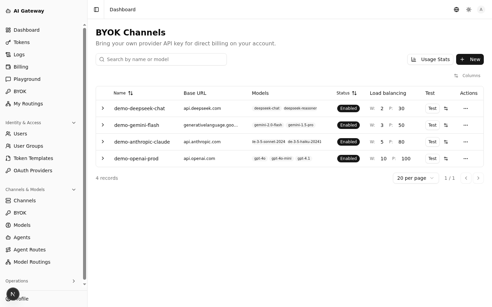
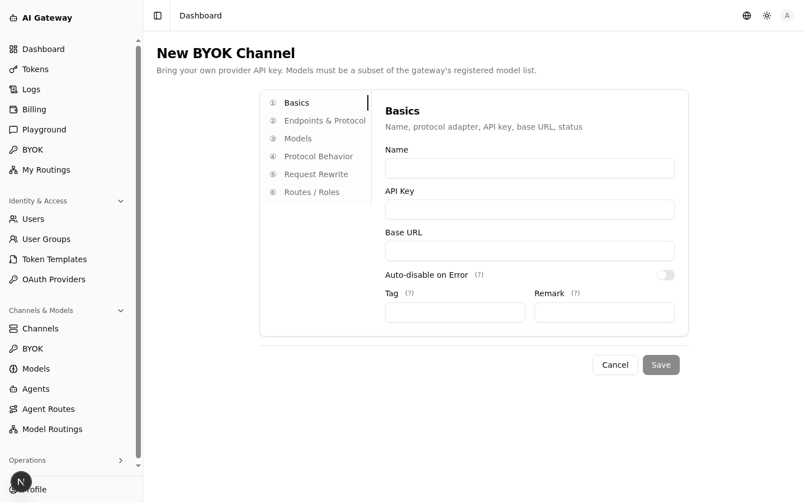
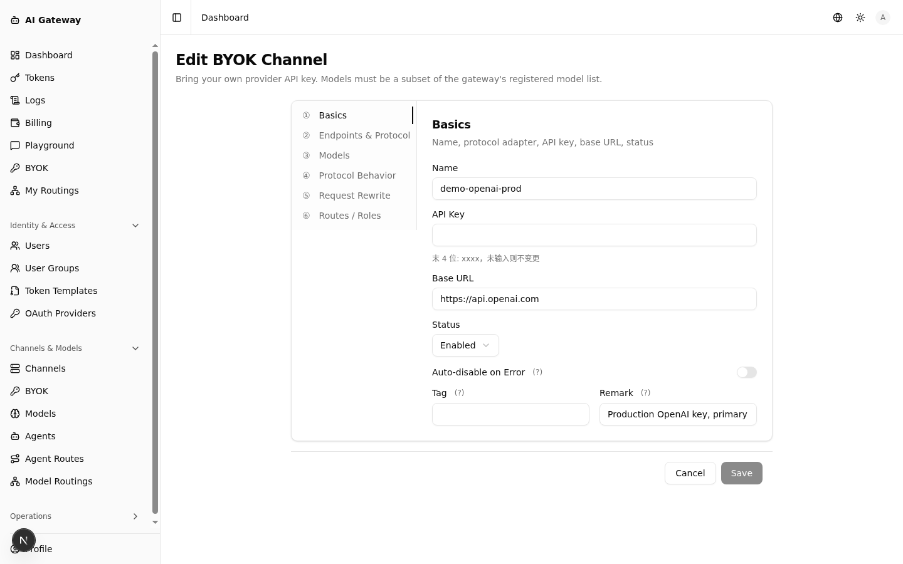
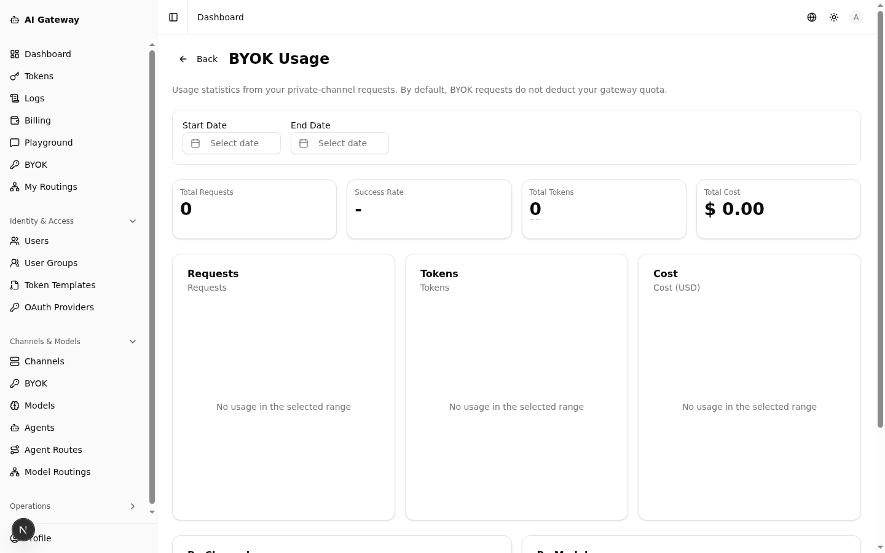
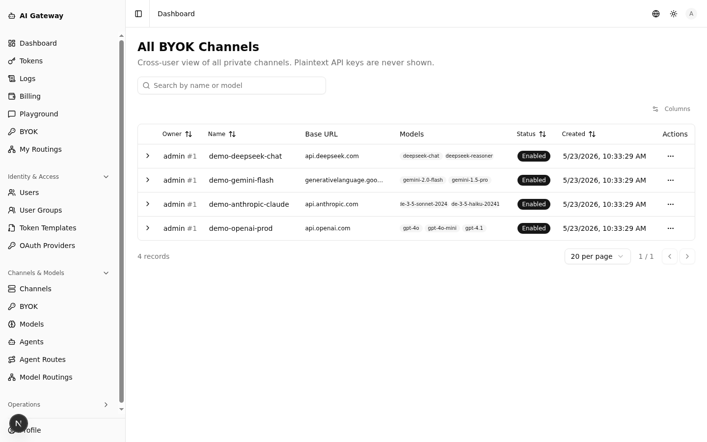
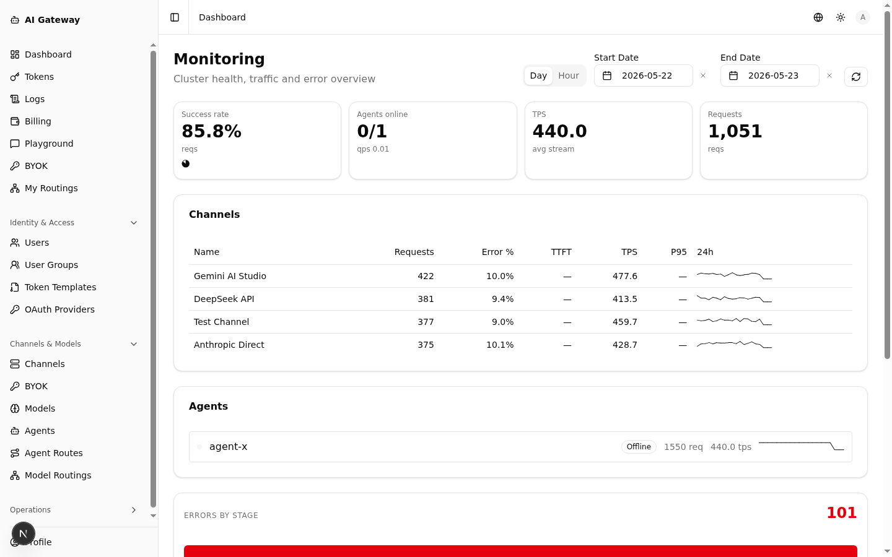
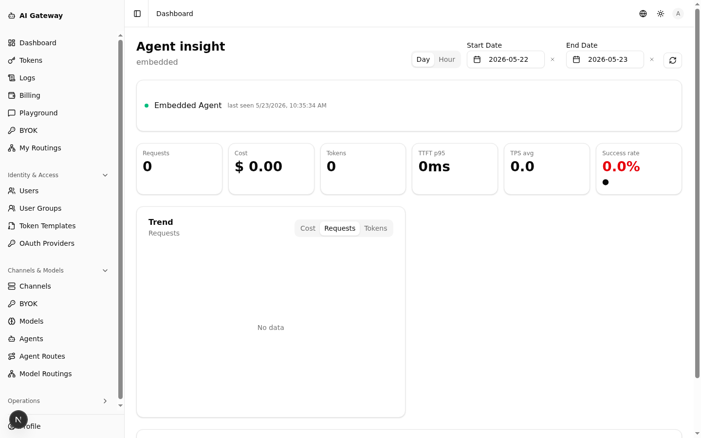

# Screenshots

A walkthrough of every page in the Web UI. All screenshots are taken with seeded demo data — every `demo-*` name (channels, tokens, users) is a placeholder, not real production data.

> 中文版本: [screenshots.zh.md](screenshots.zh.md)

---

## Overview

### Dashboard

At-a-glance counters for users, tokens, channels, models, agents, and cumulative cost.

---

## Identity & Access

### Users

Manage admin and end-user accounts; assign quotas and group membership.

### User Groups

Group-level allow-lists for channels and models. New users inherit their group's policy.

### Token Templates

Reusable presets for creating API keys with consistent model lists and expiration policies.

### OAuth Providers

Register OIDC / OAuth2 identity providers (GitHub, Google, custom IdPs) for SSO login.

### Profile

End-user profile, quota usage, and OAuth identity bindings.

---

## Channels & Models

### Channels

Configure upstream AI service providers. 50+ providers supported (OpenAI, Anthropic, Gemini, DeepSeek, Ollama, …) with weight/priority load balancing.

### Models

Per-model pricing configuration (input / output / cache tiers).

### Agents

Data-plane worker nodes — either a single embedded agent or multiple distributed agents enrolled via token.

### Agent Routes

Pin specific channels or routings to specific agents (e.g. EU traffic only on EU-region agents).

### Model Routings

Aggregate multiple upstream channel-models under one virtual model name, with priority and weighted load balancing.

---

## BYOK (Bring Your Own Key)

End users plug in their own provider API key — cost is billed directly against their own account and does not consume gateway quota.

### BYOK Channels

Per-user list of private channels: status, allowed models, load-balancing weight, and a connectivity-test action.

### New BYOK Channel

Stepped form: Basics → Endpoints & Protocol → Models → Protocol Behavior → Request Rewrite → Routes / Roles. Models must be a subset of the gateway's registered model list.

### Edit BYOK Channel

Modify name, Base URL, status, protocol behavior, etc. API key echoes only the last 4 digits — leave blank to keep the existing key.

### BYOK Usage Stats

Per-user request / token / cost trend across their own private channels, broken down by channel and by model.

### All BYOK Channels (Admin)

Cross-user audit view of every private channel + owner + status. Plaintext API keys are never shown; admin can disable any channel with one click.

---

## Tokens & Usage

### Tokens

Per-user API keys with optional model allow-list, channel allow-list, and expiration.

### Logs

Per-request audit log with token / user / channel / model / cost / duration / status, plus drill-down to the raw request/response trace.

### Billing

Daily rollups by token and by channel — total cost, request count, success rate, token usage. Rebuild from raw logs on demand.

---

## Tools

### Playground

In-browser chat tester for any configured model. Supports Chat / JSON / SSE views and arbitrary system prompts.

### My Routings

User-scoped model routings — each user can define their own private pools without touching global routings.

---

## Operations

### Monitoring

Cluster health overview: success rate, agents online, TPS, request count; per-channel and per-agent 24h trend and error rate; errors broken down by request stage.

### Entity Insight

Drill-down view for a single entity (agent / channel / model / token): KPIs, trend, errors, stage-latency distribution, related breakdowns.

### System Settings

Site-wide settings: registration toggle, branding, feature flags.

### Cache Monitoring

LRU cache stats for the agent's token/user cache — hit rate, capacity, eviction count.

---

## Authentication

### Login

Username + password and OAuth login via configured providers.

### Register

Self-registration (can be toggled off in System Settings).

